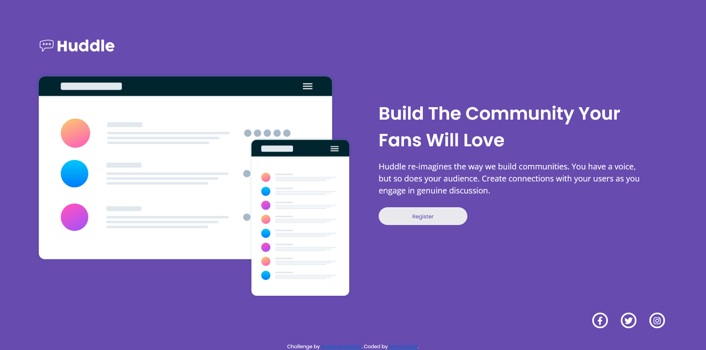

# Frontend Mentor - Huddle landing page with single introductory section solution

This is a solution to the [Huddle landing page with single introductory section challenge on Frontend Mentor](https://www.frontendmentor.io/challenges/huddle-landing-page-with-a-single-introductory-section-B_2Wvxgi0).

## Table of contents

- [Overview](#overview)
  - [The challenge](#the-challenge)
  - [Screenshot](#screenshot)
  - [Links](#links)
- [My process](#my-process)
  - [Built with](#built-with)
  - [What I learned](#what-i-learned)
  - [Continued development](#continued-development)
  - [Useful resources](#useful-resources)
- [Author](#author)
- [Acknowledgments](#acknowledgments)

## Overview

### The challenge

Users should be able to:

- View the optimal layout for the page depending on their device's screen size
- See hover states for all interactive elements on the page

### Screenshot

### Links

- Solution URL: [https://github.com/emjogale/huddle-landing-page](https://github.com/emjogale/huddle-landing-page)
- Live Site URL: [https://huddle-landing-page-lilac.vercel.app/](https://huddle-landing-page-lilac.vercel.app/)

## My process

### Built with

- Semantic HTML5 markup
- SCSS
- Flexbox
- Mobile-first workflow

### What I learned

Having completed a few challenges a bit haphazardly I decided to try and neaten up my approach. I felt it was time I dipped my toe into using SCSS and also look into better naming strategies for the classes I use. Although this is a fairly simple challenge I thought it was best to start small and see how I got on.
Along the way I found some very useful articles

### Continued development

I enjoyed using SCSS for this, although as it is a small project it was fairly limited to what I could try out. I'm hoping I have correctly used the syntax. I would like to do a slightly bigger project to see how I can develop my use of SCSS and also further improve my class naming skills.
I also need to get more of a grasp on using Font Awesome icons - as I found that quite tricky.

### Useful resources

- [Should We Use CSS or SCSS in 2021?](https://blog.bitsrc.io/will-scss-be-replaced-by-css3-754842d6b681) - This helped me to clarify the benefits of SCSS
- [Sass official documentation](https://sass-lang.com/documentation/syntax) - this helped to clear up my confusion with the differences between Sass and SCSS.
- [Introduction to Sass/Scss](https://www.studytonight.com/sass/introduction-to-sass-scss) - I found this helpful alongside the official docs

## Author

- Frontend Mentor - [@emjogale](https://www.frontendmentor.io/profile/emjogale)
- Twitter - [@emmagale2635](https://www.twitter.com/emmagale2635)

## Acknowledgments

I got inspiration and guidance on how to structure the Html and naming the classes from Grace Snow's project [Mobile-first CSS grid layout, with scss, and flexbox in card headers](https://github.com/grace-snow/fmentor_testimonials-grid-section-main)
